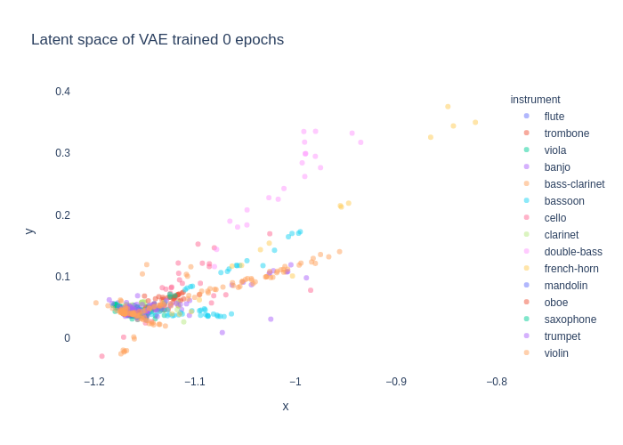

<div>

</div>
<br>


Variational Autoencoder for Timbre...

beta.0 (December 2020) version


## Documentation

See documentation [here]()


## Dependencies

* [Numpy](https://numpy.org/)
* [torch]()
* [plotly]()
* [Librosa]()
* [Flask]()
* [Flask cors]()
* [Coverage]()


## Latent Space Visualizations




## CQT Reconstructions


## Dataset

* Training: London Philarmonic Orchestra dataset


## Repository Structure

Directories:

* <strong>vae</strong>: module containing VAE architecture, training and data uitilities.
    * .py: main module.
    * configs.py
    * data_utils.py
    * loss.py
    * model.py
    * train.py
    * plot_utils.py


* <strong>plots</strong>: latent space and reconstruction plots.


* <strong>tests</strong>:
    * .py


* <strong>notebooks</strong>:
    * 1-.ipynb
    * 2-.ipynb
    * 3-.ipynb
  
  
* <strong>webserver</strong>: integration of audioanalysis module in Flask.


## Installation

```
cd .path/to/timbre-vae
python setup.py install
```

## References

[1] 

## Authors

[**Carlos Hernández**](https://carlosholivan.github.io/index.html) - carloshero@unizar.es

Department of Electronic Engineering and Communications, Universidad de Zaragoza, Calle María de Luna 3, 50018 Zaragoza